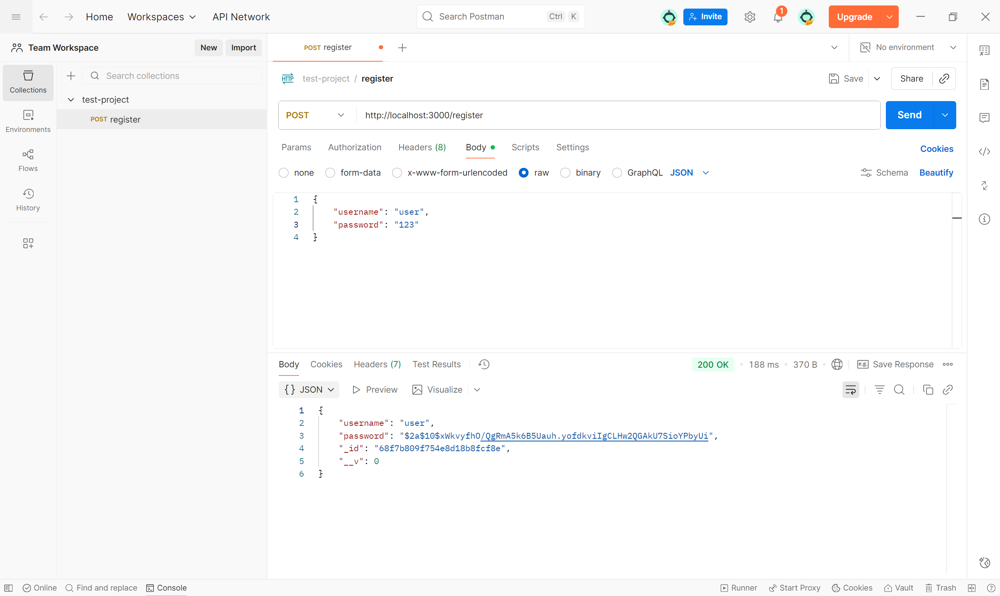
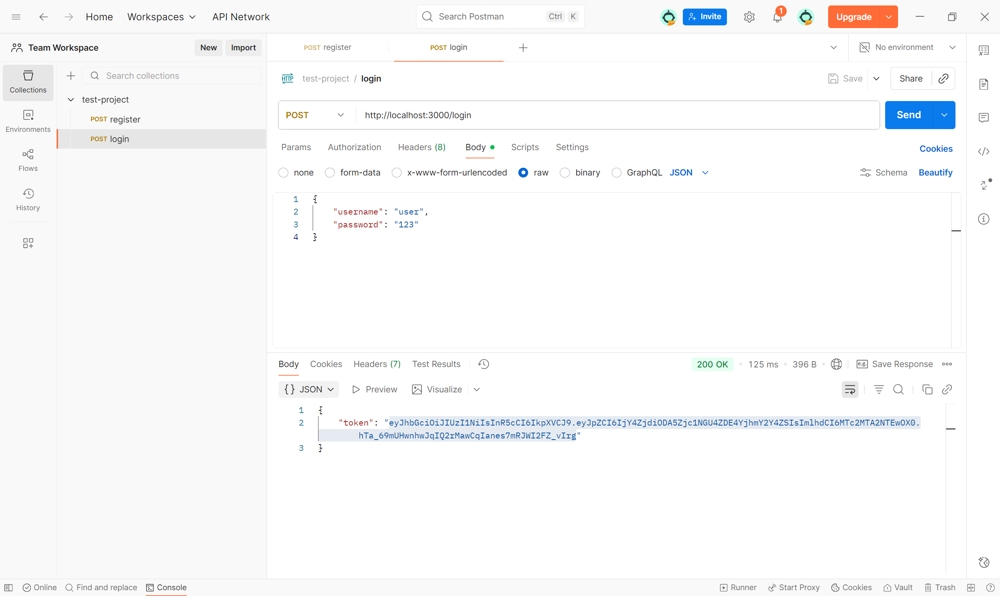
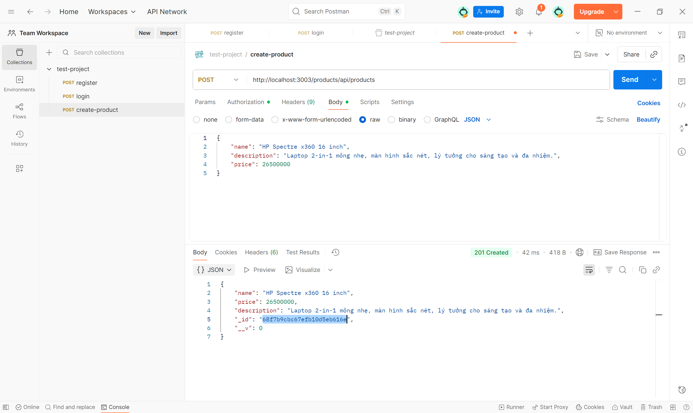
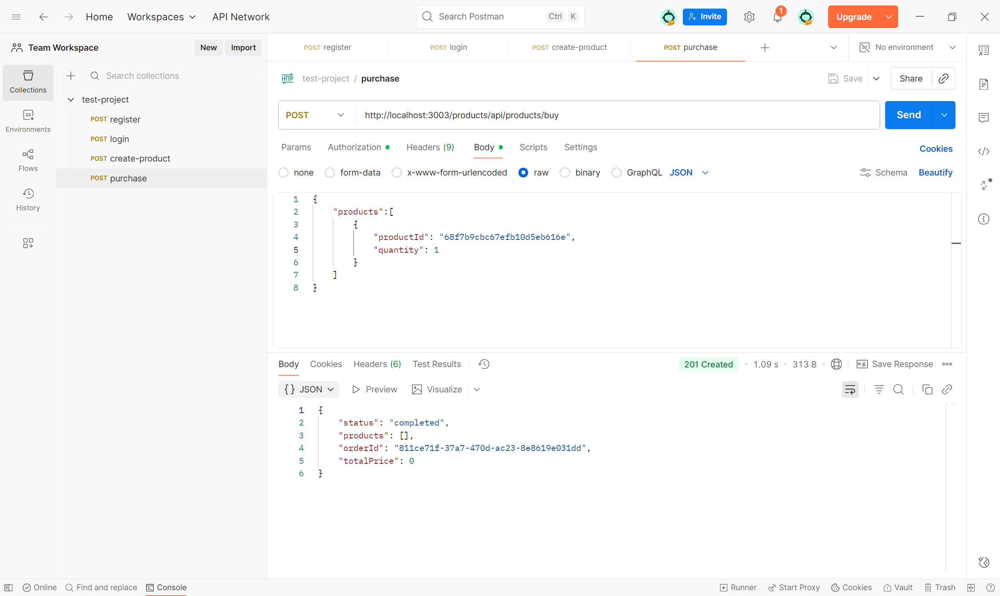

# E-Project: HỆ THỐNG MICROSERVICES BÁN HÀNG

Đây là một dự án backend mô phỏng một hệ thống thương mại điện tử đơn giản, được xây dựng theo kiến trúc microservices.


## Kiến trúc hệ thống

Dự án bao gồm các thành phần chính:
- **API Gateway**: Cổng tiếp nhận tất cả yêu cầu từ client, định tuyến đến các service phù hợp.
- **Auth Service**: Quản lý xác thực người dùng (đăng ký, đăng nhập, tạo token JWT).
- **Product Service**: Quản lý thông tin sản phẩm.
- **Order Service**: Xử lý đơn hàng và giao tiếp với các service khác thông qua message queue.
- **MongoDB**: Cơ sở dữ liệu NoSQL cho từng service.
- **RabbitMQ**: Message Broker hỗ trợ giao tiếp bất đồng bộ giữa các service.

---

## Cấu trúc dự án

```
project-root/
├─ .github/workflows/
├─ api-gateway/
├─ auth/
│  └─ src/
│     ├─ config/
│     ├─ controllers/
│     ├─ middlewares/
│     ├─ models/
│     ├─ repositories/
│     └─ services/
├─ product/
│  └─ src/
│     ├─ controllers/
│     ├─ models/
│     ├─ repositories/
│     ├─ routes/
│     └─ utils/
├─ order/
│  └─ src/
│     ├─ app.js
│     ├─ models/
│     └─ utils/
├─ utils/
├─ public/                     
├─ docker-compose.yml
├─ package.json
├─ package-lock.json
└─ README.md
```

---

## Yêu cầu cài đặt

Trước khi chạy dự án, hãy đảm bảo máy bạn đã cài:
* [Docker](https://www.docker.com/products/docker-desktop/) 
* [Postman](https://www.postman.com/downloads/) 
* [Git](https://git-scm.com/downloads/)

---

## Cấu hình môi trường (.env)

Định nghĩa các thành phần:
- `MONGODB_AUTH_URI`, `MONGODB_PRODUCT_URI`, `MONGODB_ORDER_URI`: Kết nối với các cơ sở dữ liệu MongoDB (auth, product, order).
- `JWT_SECRET`: Khóa bí mật dùng để tạo và xác thực các token JWT.
- `RABBITMQ_URI`: Kết nối đến RabbitMQ để giao tiếp giữa các service.
- `PORT`: Cổng mà API Gateway sẽ lắng nghe yêu cầu từ người dùng.
- `LOGIN_TEST_USER`, `LOGIN_TEST_PASSWORD`: Thông tin người dùng thử nghiệm cho việc kiểm tra tự động (nếu cần).


Tạo file `.env` trong từng thư mục `auth/`, `product/`, và `order/` với các biến môi trường tương ứng:

- Auth Service (`auth/.env`):
```env
MONGODB_AUTH_URI=mongodb+srv://<username>:<password>@<cluster-name>.mongodb.net/<auth-database>
JWT_SECRET=your_jwt_secret_key
RABBITMQ_URI=amqp://<username>:<password>@<host>:<port>
```

- Product Service (`product/.env`):
```env
MONGODB_PRODUCT_URI=mongodb+srv://<username>:<password>@<cluster-name>.mongodb.net/<product-database>
JWT_SECRET=your_jwt_secret_key
RABBITMQ_URI=amqp://<username>:<password>@<host>:<port>
AUTH_SERVICE_URL=http://auth:3000

# Tuỳ chọn cho kiểm thử
LOGIN_TEST_USER=test@example.com
LOGIN_TEST_PASSWORD=test_password
```

- Order Service (`order/.env`):
```env
MONGODB_ORDER_URI=mongodb+srv://<username>:<password>@<cluster-name>.mongodb.net/<order-database>
JWT_SECRET=your_jwt_secret_key
RABBITMQ_URI=amqp://<username>:<password>@<host>:<port>
```

⚠️ **Lưu ý:** 
* Dùng chuỗi kết nối MongoDB khác nhau cho từng service để tách biệt dữ liệu. 
* Giữ bí mật `JWT_SECRET` và không commit.

---

## Cài đặt dependencies

Chạy từng dòng lệnh sau trong terminal để cài đặt các package cho từng service:   
Bắt đầu từ thư mục gốc của dự án:
```cmd
npm ci
```
Sau khi lệnh thực hiện xong, tiếp tục với các đoạn bên dưới
```cmd
cd auth && npm ci && cd ..
```
```cmd
cd product && npm ci && cd ..
```
```cmd
cd order && npm ci && cd ..
```
```cmd
cd api-gateway && npm ci && cd ..
```

---

## Khởi chạy bằng Docker

Mở terminal ở thư mục gốc của dự án và chạy lệnh:
```cmd
docker-compose up --build
```
Docker sẽ tự động build image và chạy tất cả service.
Để dừng hệ thống, nhấn `Ctrl + C`.

---

## Kiểm thử với Postman

Sau khi hệ thống chạy, dùng Postman để gửi request kiểm thử.

### 1. Đăng ký tài khoản
* **Method**: `POST`
* **URL**: `http://localhost:3000/register`
* **Body** (`raw`, `JSON`):
    ```json
    {
        "username": "user",
        "password": "123"
    }    
    ```
    Example:
    

### 2. Đăng nhập
* **Method**: `POST`
* **URL**: `http://localhost:3000/login`
* **Body** (`raw`, `JSON`):
    ```json
    {
        "username": "testuser",
        "password": "123"
    }
    ```
    Example:  
    

* 💡 Lưu lại `token` trả về để sử dụng ở các bước tiếp theo.

### 3. Tạo sản phẩm mới
* **Method**: `POST`
* **URL**: `http://localhost:3003/products/api/products`
* **Authorization**: Chọn `Bearer Token` và dán `token` đã copy ở Bước 2.
* **Body** (`raw`, `JSON`):
    ```json
    {
        "name": "HP Spectre x360 16 inch",
        "description": "Laptop 2-in-1 mỏng nhẹ, màn hình sắc nét, lý tưởng cho sáng tạo và đa nhiệm.",
        "price": 26500000
    }
    ```
    Example:
    
   
* **Lưu ý**: Copy lại giá trị `_id` của sản phẩm vừa tạo.

### 4. Tạo đơn hàng mới
* **Method**: `POST`
* **URL**: `http://localhost:3003/products/api/products/buy` 
* **Authorization**: Dùng `token` như trên
* **Body** (`raw`, `JSON`):
    ```json
    {
        "products": [
            {
                "productId": "paste-ID-here",
                "quantity": 1
            }
        ]
    }
    ```
    Example:
    

---

## Kết luận

- Dự án này giúp bạn hiểu và thực hành kiến trúc microservices cơ bản.  
- Bạn có thể tự phát triển thêm các tính năng mới hoặc tùy chỉnh theo nhu cầu.  
- Cảm ơn bạn đã quan tâm và sử dụng dự án.
